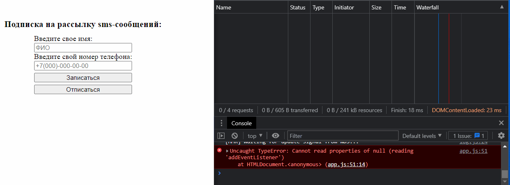
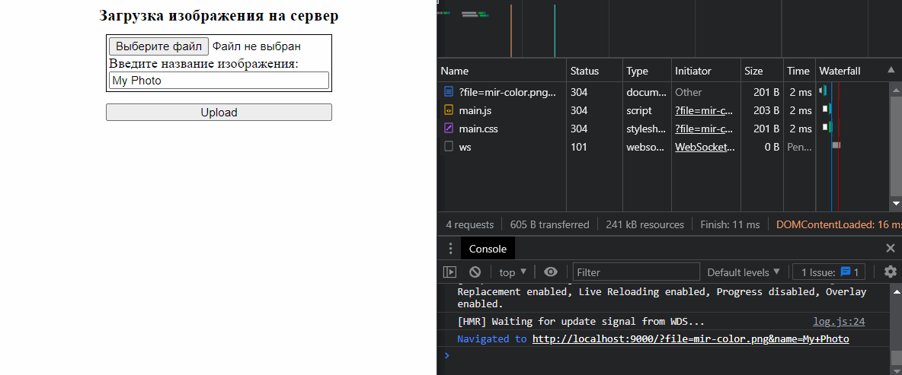

## Отправление HTTP-запросов на сервер и обработка ответа сервера

 

#### [BackEnd проекта](https://github.com/Go5710264/HTTP-requests-back.git)

 

### Запрос на оформление sms-подписки на сервер.

-   Успешная обработка запроса - `OK. You have added your phone number for sending sms`
- При повторной отправке запроса с теми-же данными - `subscripiton exists`. Сервер отказывает в обработке данных.
- Отправка успешного запроса на отписку - `OK. Уou have unsubscribed from the sms mailing list`
- При отправке запроса на отписку с данными, которых нет на сервере - `subscripiton doesn't exists`

 

 

### Отправление изображения на сервер с одновременным отображением на странице

 

